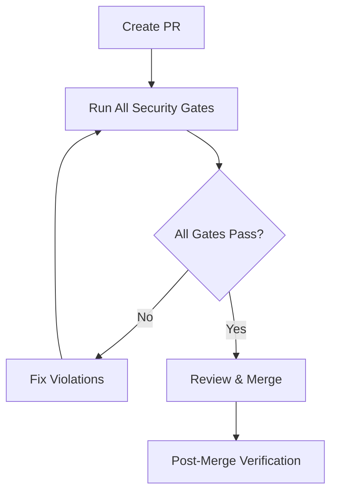

# Security & CI Union Resolution Guide

**Status**: Implemented
**Last Updated**: 2025-11-05
**Author**: Alter Agro Security Team
**License**: BUSL-1.1

---

## Executive Summary

This document describes the union resolution of two critical security feature sets:

- **Branch A**: Leak detection and monitoring infrastructure
- **Branch B**: Spec-only enforcement and KPI gates

The union ensures comprehensive security coverage with no conflicts or gaps.

---

## Architecture Overview

### Security Gates (All Required)

The following CI/CD gates are now enforced on all pull requests to `main`:

1. **hash-verify** - Hash ledger integrity verification
2. **path-allowlist** - Spec-only path enforcement
3. **spec-only-gate** - File type restrictions
4. **kpi-check** - LSA/RAG quality metrics
5. **information-barrier** - Trade secret leak prevention
6. **leak-detection-monitoring** - Continuous secret scanning

All gates must pass for a PR to be mergeable.

---

## Hash Ledger Management

### Purpose

The hash ledger (`infra/github/hash_ledger.json`) provides cryptographic integrity verification for all tracked files.

### Self-Reference Handling

The ledger includes a self-referential entry with an empty hash:

```json
{
  "infra/github/hash_ledger.json": "",
  ...
}
```

This is **intentional** and allows the ledger to be updated without creating circular dependencies.

### Updating the Ledger

After making changes to tracked files:

```bash
# Update all hashes
python infra/github/update_ledger.py

# Verify integrity
python infra/github/verify_hashes.py --ledger infra/github/hash_ledger.json

# Commit the updated ledger
git add infra/github/hash_ledger.json
git commit -m "chore(security): update hash ledger"
```

### Tracked Files

The ledger tracks files in these directories:
- `.github/` - CI/CD workflows and templates
- `docs/` - Documentation
- `legal/` - Legal documents
- `infra/github/` - Security scripts (except verify_hashes_strict.py)
- `lsa/spec/` - LSA specifications
- `rag/spec/` - RAG specifications

---

## Spec-Only Enforcement

### Allowed Paths

Only these top-level directories are permitted:

```
.github/         # CI/CD configuration
docs/            # Documentation
legal/           # Legal documents
infra/github/    # Security infrastructure
lsa/spec/        # LSA specifications
rag/spec/        # RAG specifications
```

Plus these root files:
- `README.md`
- `.gitignore`
- `.gitleaks.toml`
- `.gitleaksignore`
- `.pre-commit-config.yaml`

### Blocked File Types

The following are **strictly prohibited**:

```
# Runtime code (unless in infra/github/ or .github/)
*.py, *.ipynb, *.js, *.ts, *.go, *.java, *.rb, *.php, *.rs

# Binaries & model files
*.bin, *.so, *.dll, *.dylib, *.exe
*.safetensors, *.ckpt, *.pth, *.pkl, *.h5, *.pb, *.onnx

# Archives
*.tar.gz, *.zip, *.7z, *.rar

# Secrets & credentials
*.env, *.pem, id_rsa, id_ed25519, credentials.json

# Data files
*.csv, *.parquet
```

---

## KPI Enforcement

### Thresholds

All PRs must meet these quality thresholds:

```python
# LSA Quality Metrics
fail_closed_rate = 0.0      # Must be zero (no bypasses)
span_fidelity ≥ 0.80        # 80% minimum
decision_coverage ≥ 0.90    # 90% minimum

# RAG Quality Metrics
contradiction_coverage ≥ 0.90  # 90% minimum
source_verification = "enabled"
```

### Running KPI Checks Locally

```bash
# Score LSA specs
python infra/github/kpi_score.py \
  --spec_dir lsa/spec \
  --out infra/github/kpi_report.json

# Assert thresholds
python infra/github/kpi_assert.py \
  --report infra/github/kpi_report.json \
  --min_faithfulness 0.95 \
  --min_contradiction 0.90
```

---

## Leak Detection & Monitoring

### Multi-Layer Scanning

Three complementary scanners provide defense-in-depth:

1. **GitLeaks** - Rule-based secret detection
2. **TruffleHog** - Entropy-based secret detection
3. **Custom DLP Scanner** - Alter Agro-specific patterns

### Scan Coverage

The leak detection workflow scans for:

- **Secrets**: API keys, tokens, passwords, bearer tokens
- **Credentials**: AWS keys, private keys, GitHub PATs
- **Customer Data**: Emails, phone numbers, CPF/CNPJ
- **Pricing**: Currency amounts, specific pricing data
- **Infrastructure**: Internal domains, IP addresses
- **Prompts**: LLM prompt engineering patterns
- **Models**: Model references, fine-tuned model identifiers

### Pre-Commit Hooks

Install pre-commit hooks to catch issues before commit:

```bash
# Install hooks
bash .github/scripts/install-hooks.sh

# Manual run
pre-commit run --all-files
```

### GitLeaks Configuration

Custom configuration in `.gitleaks.toml`:

```toml
[allowlist]
description = "Spec-only repo—block obvious secrets, allow docs/text"
files = [
  '''^docs/''',
  '''^lsa/''',
  '''^rag/''',
  '''^legal/''',
  '''^\.github/''',
]
```

---

## Workflow Integration

### Branch Protection Rules

Configure these required status checks in GitHub:

**Settings → Branches → main → Require status checks**

Required checks:
- ✅ `hash-verify`
- ✅ `path-allowlist`
- ✅ `spec-only-gate`
- ✅ `kpi-check`
- ✅ `information-barrier`
- ✅ `leak-detection-monitoring`

### PR Workflow



---

## Troubleshooting

### Hash Verification Failures

**Symptom**: `hash-verify` workflow fails with mismatches

**Fix**:
```bash
# Update ledger with current file states
python infra/github/update_ledger.py

# Verify fix
python infra/github/verify_hashes.py --ledger infra/github/hash_ledger.json

# Commit
git add infra/github/hash_ledger.json
git commit -m "chore(security): update hash ledger after changes"
```

### Allowlist Violations

**Symptom**: `path-allowlist` workflow fails

**Fix**:
```bash
# Check violations
python infra/github/check_allowlist.py --fix

# Move files to allowed paths or update allowlist
# If intentional, update ALLOWED_PATHS in check_allowlist.py
```

### Secret Detection False Positives

**Symptom**: GitLeaks flags documentation examples

**Fix**:
```toml
# Add to .gitleaks.toml [allowlist] section
paths = [
  '''path/to/documentation\.md''',
]

regexes = [
  '''example.*pattern''',
]

stopwords = [
  '''example''',
  '''placeholder''',
]
```

### KPI Threshold Failures

**Symptom**: `kpi-check` workflow fails

**Fix**:
```bash
# Generate detailed report
python infra/github/kpi_score.py \
  --spec_dir lsa/spec \
  --out kpi_report.json \
  --verbose

# Review report and improve specs
cat kpi_report.json | jq .

# Common fixes:
# - Add decision records for fail_closed_rate
# - Improve span coverage for span_fidelity
# - Add contradiction tests for contradiction_coverage
```

---

## Testing Security Gates Locally

Before pushing, test all gates locally:

```bash
#!/bin/bash
# test-security-gates.sh

echo "🔍 Testing all security gates..."
echo ""

# 1. Hash verification
echo "1️⃣  Hash Verification"
python infra/github/verify_hashes.py --ledger infra/github/hash_ledger.json || exit 1
echo "✅ Hash verification passed"
echo ""

# 2. Allowlist check
echo "2️⃣  Allowlist Check"
python infra/github/check_allowlist.py || exit 1
echo "✅ Allowlist check passed"
echo ""

# 3. Secret scanning
echo "3️⃣  Secret Scanning"
python infra/github/scan_secrets.py --quiet || exit 1
echo "✅ Secret scanning passed"
echo ""

# 4. KPI checks
echo "4️⃣  KPI Checks"
python infra/github/kpi_score.py --spec_dir lsa/spec --out /tmp/kpi_report.json
python infra/github/kpi_assert.py --report /tmp/kpi_report.json --min_faithfulness 0.95 --min_contradiction 0.90 || exit 1
echo "✅ KPI checks passed"
echo ""

# 5. GitLeaks
echo "5️⃣  GitLeaks Scan"
if command -v gitleaks &> /dev/null; then
    gitleaks detect --config .gitleaks.toml --no-git || exit 1
    echo "✅ GitLeaks scan passed"
else
    echo "⚠️  GitLeaks not installed, skipping"
fi
echo ""

echo "━━━━━━━━━━━━━━━━━━━━━━━━━━━━━━━━━━━━━━━━━━━━━━━━━━━━━"
echo "✅ ALL SECURITY GATES PASSED"
echo "━━━━━━━━━━━━━━━━━━━━━━━━━━━━━━━━━━━━━━━━━━━━━━━━━━━━━"
```

---

## Maintenance

### Regular Tasks

**Daily** (automated via cron in `leak-detection-monitoring`):
- Secret scanning of repository
- Binary/model file detection

**Per PR** (automated via CI):
- Hash verification
- Allowlist enforcement
- KPI threshold checks
- Comprehensive leak detection

**Monthly** (manual):
- Review security workflow effectiveness
- Update detection patterns in `scan_secrets.py`
- Review and prune `.gitleaks.toml` allowlist
- Audit hash ledger history

### Security Dashboard

Generate security metrics:

```bash
python infra/github/security_dashboard.py \
  --output dashboard.json

# View dashboard
cat dashboard.json | jq .
```

---

## Emergency Procedures

### Leaked Secret Detected

If a secret is detected in the repository:

1. **Immediate**: Rotate the exposed credential
2. **Remove**: Clean secret from current HEAD
3. **History**: Use `git filter-branch` or `BFG Repo Cleaner` to remove from history
4. **Audit**: Review access logs for exposure timeline
5. **Report**: File security incident report

### False Positive Rate Too High

If security gates have too many false positives:

1. Review patterns in `scan_secrets.py` and `.gitleaks.toml`
2. Add documentation paths to exclusion lists
3. Use `stopwords` in `.gitleaks.toml` for common false positives
4. Update allowlist patterns for legitimate use cases
5. Document changes in security incident log

---

## References

- [Information Barrier Workflow](.github/workflows/information-barrier.yml)
- [Leak Detection Workflow](.github/workflows/leak-detection-monitoring.yml)
- [Hash Verification Workflow](.github/workflows/hash-verify.yml)
- [KPI Check Workflow](.github/workflows/kpi-check.yml)
- [Path Allowlist Workflow](.github/workflows/path-allowlist.yml)
- [Spec-Only Gate Workflow](.github/workflows/spec-only-gate.yml)

---

## Changelog

### 2025-11-05 - Union Resolution
- ✅ Merged leak detection (Branch A) with spec-only enforcement (Branch B)
- ✅ Fixed hash ledger self-reference handling
- ✅ Updated `verify_hashes.py` to support key-value format
- ✅ Added `leak-detection-monitoring.yml` workflow
- ✅ Updated `check_allowlist.py` to include security config files
- ✅ Documented complete security architecture

### Previous History
- 2025-11-03 - Added spec-only enforcement and KPI gates
- 2025-11-02 - Implemented hash ledger system
- 2025-11-01 - Added information barrier workflow
- 2025-10-30 - Initial security infrastructure

---

**Document Classification**: P1-Internal
**Review Cycle**: Monthly
**Next Review**: 2025-12-05
